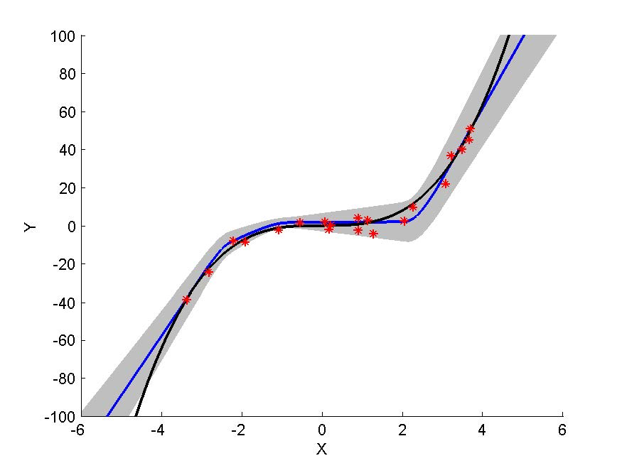
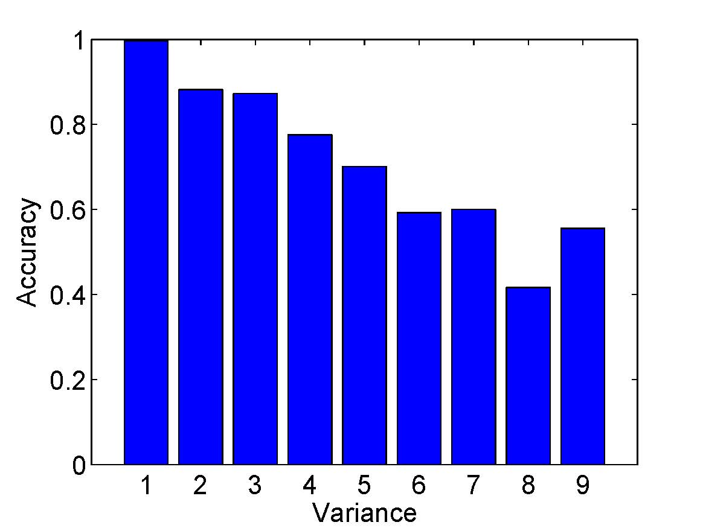

Natural-Parameter Networks (NPN) in PyTorch
============

This is the PyTorch code for the NIPS paper ['Natural-Parameter Networks: A Class of Probabilistic Neural Networks'](http://wanghao.in/paper/NIPS16_NPN.pdf). 

It is a class of probabilistic neural networks that treat both weights and neurons as distributions rather than just points in high-dimensional space. Distributions are first-citizens in the networks. The design allows distributions to feedforward and backprop across the network. Given an input data point, NPN will output a predicted distribution with information on both the prediction and uncertainty.

Note that this is the code for Gaussian NPN to run on the MNIST and Boston
Housing datasets. For Gamma NPN or Poisson NPN please go to the other repo.

## Example results on uncertainty-aware prediction:
### Output both prediction and uncertainty for regression:
<p align="center">

</p>
Above is the predictive distribution for NPN. The shaded regions correspond
to 3 standard deviations. The black curve is the data-generating function and blue curves
show the mean of the predictive distributions. Red stars are the training data.

### Accuracy versus uncertainty (variance):
<p align="center">

</p>
Above is the classification accuracy for different variance (uncertainty). Note that ‘1’ in the x-axis means the variance is in the range [0, 0.04), ‘2’ means the variance is in the range [0.04, 0.08), etc.

## Accuracy: 

Using only 100 training samples in the training set of MNIST:


| Method | Accuracy |
| -------|----------|
| NPN (ours) | 74.58% |
| MLP | 69.02% |
| CNN+NPN (ours) | 86.87% |
| CNN+MLP | 82.90% |

## RMSE:

Regression task on Boston Housing:

| Method | RMSE |
| -------|----------|
| NPN (ours) | 3.2197 |
| MLP | 3.5748 |

## How to run the code:

* In general, to train the model, run the command: 'sh mlp-att.sh'
* To train NPN (fully connected), run the command: 'sh npn.sh'
* To train MLP (fully connected), run the command: 'sh mlp.sh'
* To train CNN+NPN, run the command: 'sh cnn_npn.sh'
* To train CNN+MLP, run the command: 'sh cnn_mlp.sh'
* For regression tasks (Boston Housing) using NPN, run the command: 'sh regress_npn.sh'
* For regression tasks (Boston Housing) using MLP, run the command: 'sh regress_mlp.sh'

## Short code example:

```python
from npn import NPNLinear
from npn import NPNSigmoid
class NPNNet(nn.Module):
    def __init__(self):
        super(NPNNet, self).__init__()

        # Last parameter of NPNLinear
        # True: input contains both the mean and variance
        # False: input contains only the mean
        self.fc1 = NPNLinear(784, 800, False)
        self.sigmoid1 = NPNSigmoid()
        self.fc2 = NPNLinear(800, 800)
        self.sigmoid2 = NPNSigmoid()
        self.fc3 = NPNLinear(800, 10)
        self.sigmoid3 = NPNSigmoid()

    def forward(self, x):
        x = self.sigmoid1(self.fc1(x))
        x = self.sigmoid2(self.fc2(x))
        # output mean (x) and variance (s) of Gaussian NPN
        x, s = self.sigmoid3(self.fc3(x))
        return x, s 
```

## Install:

The code is tested under PyTorch 0.2.03 and Python 3.5.2.

## Other implementations (third-party):

Another version of Pytorch/Python code (with extension to GRU) by [sohamghosh121](https://github.com/sohamghosh121/natural-parameter-networks).

## Reference:
[Natural-Parameter Networks: A Class of Probabilistic Neural Networks](http://wanghao.in/paper/NIPS16_NPN.pdf)
```
@inproceedings{DBLP:conf/nips/WangSY16,
  author    = {Hao Wang and
               Xingjian Shi and
               Dit{-}Yan Yeung},
  title     = {Natural-Parameter Networks: {A} Class of Probabilistic Neural Networks},
  booktitle = {Advances in Neural Information Processing Systems 29: Annual Conference
               on Neural Information Processing Systems 2016, December 5-10, 2016,
               Barcelona, Spain},
  pages     = {118--126},
  year      = {2016}
}
```

